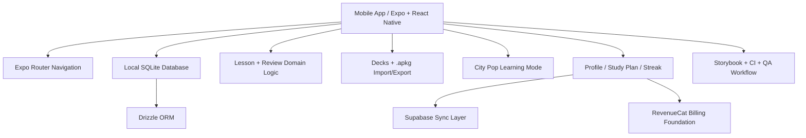

# falaGENKI

A mobile-first Japanese learning app for Brazilian Portuguese speakers, designed around local-first study flows, approachable SRS review, and music-driven engagement.

> This public repository is a product showcase. The production codebase is private.  
> This repo focuses on product direction, architecture, technical decisions, and delivery progress.

## Overview

falaGENKI is built for Brazilian learners who want a more approachable path into Japanese than traditional textbook-first or flashcard-only tools.

The product combines:

- PT-BR contextual explanations
- mobile-first lesson flows
- SRS review
- kana and early N5 foundations
- music-based learning loops
- optional cloud backup and premium foundations

The current product direction is intentionally mobile-first. Web support exists as a future possibility, but it does not drive the core architecture.

## What makes it different

- **Brazilian-first learning experience** instead of generic English-first UX
- **Local-first study loop** designed to work well before cloud sync is fully expanded
- **City Pop and music-based learning surfaces** as part of engagement and retention
- **Anki-compatible deck ecosystem** with import/export support
- **Guest-first progression** with optional account and sync boundaries
- **Casual spoken Japanese direction** as a real curriculum concern, not only JLPT-style memorization

## Product Areas

- Guided lessons
- Kana study and practice
- SRS review sessions
- Deck and card management
- Music learning / City Pop mode
- Progress, streak, XP, and study-plan support
- Optional login, backup, and premium foundations

## Demo Assets

### Screenshots

#### SplashScreens | App Icon

  
  
  

---

#### Home

  
  

---

#### Learn

  
  
  
  
  
  
  
  

---

#### Music

  
  
  

---

#### Cards

  
  

---

#### Profile

  
  
  

### Navigation GIF
A navigation GIF will be added later.

Recommended file name:

- `assets/gifs/falagenki-navigation.gif`

## Simple Architecture Diagram

## Documentation

- [Architecture Summary](docs/architecture.md)
- [Technical Decisions](docs/technical-decisions.md)
- [Roadmap](docs/roadmap.md)
- [Changelog](docs/changelog.md)

## Why this repository is public

This repository exists to present the product direction, engineering thinking, and system design behind falaGENKI without exposing the private production codebase.

It is intended to show:

- product thinking
- architecture choices
- mobile-first system design
- delivery progress
- engineering depth behind the app

## Contact

If you are a recruiter, collaborator, or hiring manager and want to discuss the project, feel free to reach out through my GitHub or LinkedIn profile.
