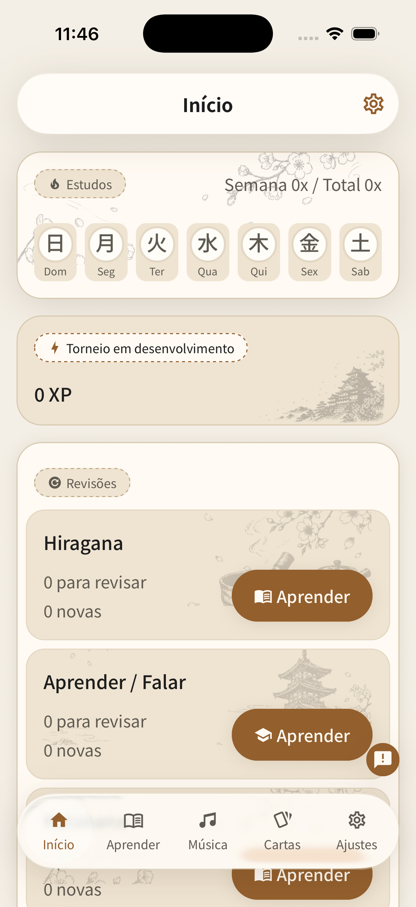
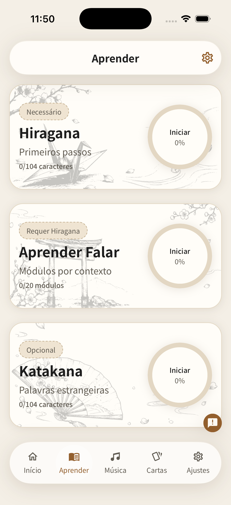
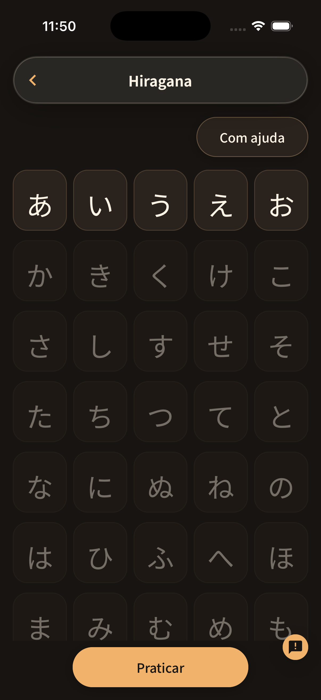
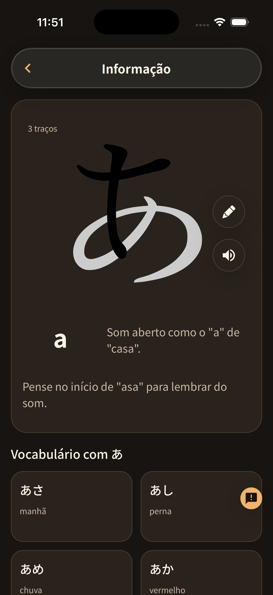
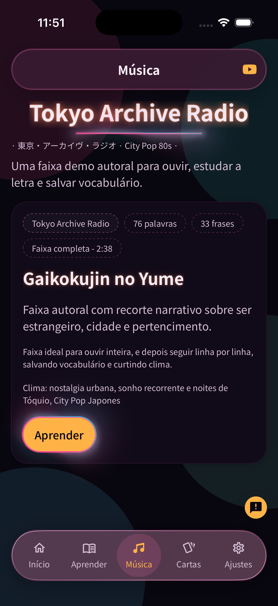
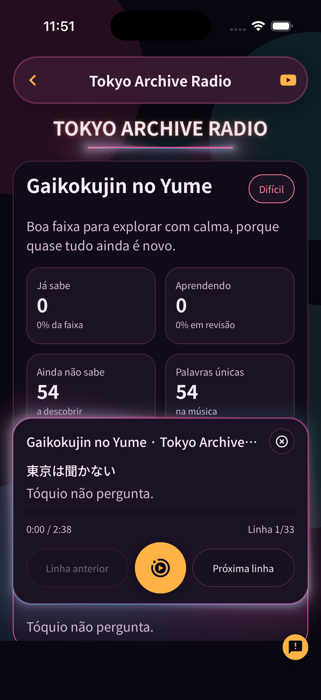
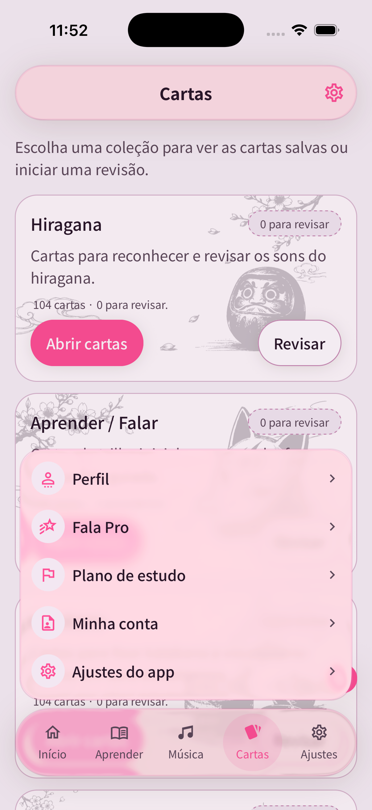
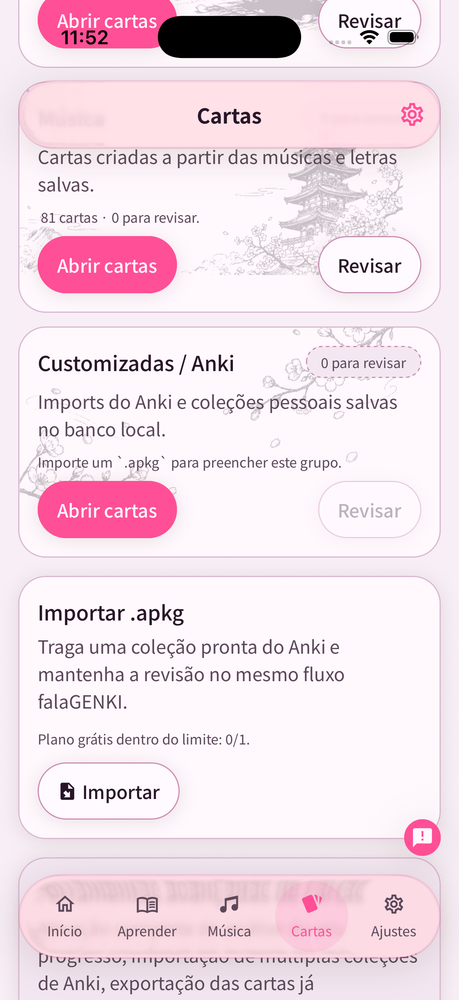
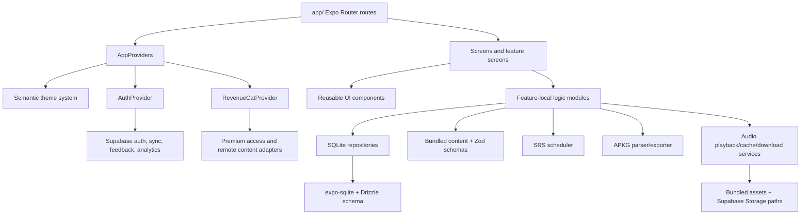

# falaGENKI

**A mobile-first Japanese learning app built for Brazilian Portuguese speakers.**

falaGENKI is an Expo + React Native product that turns early Japanese study into a local-first daily learning loop: guided kana and grammar paths, SRS review, Anki-compatible decks, and a City Pop listening mode where vocabulary can move from lyrics into review.

The project is still in active development, but it already demonstrates the kind of work expected from a production mobile codebase: typed domain models, local persistence, content validation, audio pipeline tooling, premium/account foundations, Storybook previews, and automated tests.

## Why This Project Stands Out

| Product signal | Engineering signal |
| --- | --- |
| Built for Brazilian learners, not translated from an English-first app | TypeScript-first Expo architecture with route, feature, repository, and domain boundaries |
| Learning loop works without requiring an account | Local SQLite is the operational source of truth |
| Kana, lessons, cards, reviews, and music are connected into one flow | Drizzle schema, repository layer, Zod content schemas, and focused feature modules |
| City Pop is part of learning, not a decorative gimmick | Audio manifest, playback runtime, local cache, download queue, and QA tooling |
| Anki import/export support gives the app a real learner migration path | Dedicated APKG parser/converter/exporter modules |
| Launch concerns are represented early | Supabase, RevenueCat, account deletion, analytics consent, feedback, reminders, EAS, release docs |

## Current Mobile UI

Captured on iPhone 17 Pro Simulator on May 17, 2026.

<table>
  <tr>
    <td align="center" width="25%"><strong>Home</strong><br /><sub>Daily rhythm, study week, XP, and review shortcuts.</sub><br /></td>
    <td align="center" width="25%"><strong>Learn</strong><br /><sub>Guided paths for hiragana, speaking modules, and katakana.</sub><br /></td>
    <td align="center" width="25%"><strong>Hiragana Map</strong><br /><sub>Character grid with assist mode and practice entry point.</sub><br /></td>
    <td align="center" width="25%"><strong>Kana Detail</strong><br /><sub>Stroke count, sound, mnemonic, and vocabulary examples.</sub><br /></td>
  </tr>
  <tr>
    <td align="center" width="25%"><strong>Music Library</strong><br /><sub>Original City Pop demo track prepared for lyric study.</sub><br /></td>
    <td align="center" width="25%"><strong>Lyric Player</strong><br /><sub>Line-by-line listening with Japanese lyrics and PT-BR meaning.</sub><br /></td>
    <td align="center" width="25%"><strong>Cards + Menu</strong><br /><sub>Deck catalogue, review actions, and settings surfaces.</sub><br /></td>
    <td align="center" width="25%"><strong>Anki Import</strong><br /><sub>APKG import path for bringing existing decks into the app.</sub><br /></td>
  </tr>
</table>

## Product Experience

falaGENKI is designed as a study tool that feels native, calm, and useful from the first session.

- **Home:** shows the learner what matters now: study rhythm, XP, pending review, and shortcuts into the next useful action.
- **Learn:** separates foundational paths instead of dumping every activity into a single feed.
- **Kana:** combines map-based navigation, visual detail, audio playback, mnemonic support, and vocabulary examples.
- **Music:** uses an original City Pop-style demo track as a real learning surface, with line progression and vocabulary review hooks.
- **Cards:** groups review material by source: hiragana, learn/speak, katakana, music, and custom/Anki decks.
- **Settings and account surfaces:** keep the product anonymous-first while leaving room for cloud sync, premium, account management, reminders, and preferences.

All user-facing copy is written in Brazilian Portuguese. Technical docs, code, comments, and file names stay in English.

## Feature Coverage

| Area | Current implementation |
| --- | --- |
| App shell | Expo Router tabs, dynamic routes, stack routes, floating tab bar, top bars, deep-link metadata |
| Home | XP, streak/study rhythm, review shortcuts, next-step routing, local progress summaries |
| Learn | Hiragana, katakana, N5-style lesson modules, lesson progress, first-use guidance |
| Kana | Catalogues, detail pages, practice flow, romaji assist, stroke order support, local mastery tracking |
| Review | SRS queue, answer reveal, rating composer, audio-aware cards, review log persistence |
| Decks | Built-in decks, user decks, grouped catalogue, card media support, Anki import/export foundation |
| Music | City Pop catalogue, lyric segments, playback runtime, vocabulary extraction, save-to-review flow |
| Audio | Bundled starter audio, manifest repository, remote URL resolution, local cache, download queue |
| Auth and sync | Anonymous-first app state, Supabase auth boundary, study-plan sync snapshot foundation |
| Premium | RevenueCat provider, paywall, entitlement rules, premium source adapters, cached pack foundation |
| Feedback | Floating feedback entry, auth gate, image attachment metadata, Supabase-facing submit path |
| Analytics | Consent-gated local queue, typed event taxonomy, Supabase analytics transport |
| Release prep | EAS profiles, legal drafts, Supabase setup docs, RevenueCat setup docs, MVP closure checklist |

## Architecture Overview

The codebase is organized to keep UI, domain rules, local persistence, remote services, and content authoring concerns separated.


```mermaid
flowchart TD
  Routes["app/ Expo Router routes"] --> Providers["AppProviders"]
  Providers --> Theme["Semantic theme system"]
  Providers --> Auth["AuthProvider"]
  Providers --> Billing["RevenueCatProvider"]

  Routes --> Screens["Screens and feature screens"]
  Screens --> Components["Reusable UI components"]
  Screens --> FeatureLogic["Feature-local logic modules"]

  FeatureLogic --> Repositories["SQLite repositories"]
  Repositories --> LocalDB["expo-sqlite + Drizzle schema"]

  FeatureLogic --> Content["Bundled content + Zod schemas"]
  FeatureLogic --> SRS["SRS scheduler"]
  FeatureLogic --> Anki["APKG parser/exporter"]
  FeatureLogic --> Audio["Audio playback/cache/download services"]

  Auth --> Supabase["Supabase auth, sync, feedback, analytics"]
  Billing --> Premium["Premium access and remote content adapters"]
  Audio --> Storage["Bundled assets + Supabase Storage paths"]
```

## Repository Shape

```text
app/                  Expo Router tabs, stacks, dynamic routes
src/components/       Shared UI primitives, each in its own folder
src/features/         Product modules: learn, review, kana, citypop, decks, auth, premium, sync, audio
src/screens/          Route-level screen composition
src/content/          JSON learning data, source adapters, Zod schemas, provenance rules
src/db/               SQLite client, Drizzle schema, migrations, repositories, hooks, seed logic
src/srs/              Spaced repetition algorithm, scheduler, immediate recall, session logic
src/anki/             APKG parsing, conversion, export, media handling
src/theme/            Semantic tokens, theme factory/resolver, persisted theme mode
src/navigation/       Floating tab bar, top bars, deep links, shell metadata
src/storybook/        Component and product previews for design review
supabase/             SQL migrations and Edge Functions for backend-facing launch work
docs/                 Architecture, UX, audio, backend, legal, release, and handoff docs
```

## Local Data Model

falaGENKI uses local SQLite as the primary runtime store. The user can study, review, and keep progress without logging in.

| Table | Responsibility |
| --- | --- |
| `decks` / `cards` | Built-in, personal, music, and imported review material |
| `srs_reviews` | Due dates, intervals, ease factor, repetitions, lapses, review state |
| `review_log` | Historical review ratings and scheduling outcomes |
| `lesson_progress` | Completed lessons, answer counts, unlocked card counts |
| `kana_progress` | Per-kana mastery, attempts, due dates, pending review kinds |
| `kana_romaji_assist` | Temporary assist state for early kana study |
| `user_progress` | XP, streaks, level, daily goal, serialized user settings |
| `audio_assets` | Audio id/group, storage path, local URI, checksum, status, playback metadata |
| `app_meta` | App metadata and migration support |

## Bundled Learning Content

The content layer is schema-validated and reference-checked. It models grammar, examples, kana, lessons, lyrics, review cards, audio references, provenance, orthography policy, and terminology rules.

| Content type | Current count |
| --- | ---: |
| Lesson definitions | 27 |
| Hiragana records | 104 |
| Katakana records | 104 |
| Example sentences | 854 |
| Grammar notes | 17 |
| City Pop tracks | 3 |
| Lyric segments | 36 |
| Casual sentence bank groups | 4 |

## Tech Stack

| Layer | Tools |
| --- | --- |
| Mobile runtime | Expo SDK 55, React 19, React Native 0.83 |
| Navigation | Expo Router, React Native Screens, Gesture Handler |
| Language | TypeScript |
| State | Zustand, React Query where remote state is needed |
| Local persistence | expo-sqlite, Drizzle ORM |
| Backend foundation | Supabase JS, Supabase migrations, Supabase Edge Functions |
| Billing | RevenueCat |
| Audio/media | expo-audio, expo-asset, expo-file-system |
| Visual system | semantic theme tokens, expo-blur, expo-glass-effect, SVG, Skia |
| Content contracts | Zod |
| Anki support | JSZip and custom APKG parser/exporter |
| Quality | Jest, React Native Testing Library, ESLint, Madge, JSCPD, ts-prune, depcheck |
| Design review | Storybook web and native |

## Quality And Delivery Practices

This repository is structured like a product that is expected to survive iteration.

- **Typed contracts:** TypeScript across app logic and Zod for learning content/runtime payloads.
- **Feature boundaries:** screens compose feature logic instead of reaching directly into persistence or transport.
- **Local-first reliability:** critical study behavior stays available without account or network.
- **Validation scripts:** separate checks for content, kana data, N5 content, and audio manifests.
- **Storybook workflow:** component primitives and product compositions can be reviewed outside the full app.
- **Release hygiene:** EAS profiles, launch docs, legal drafts, account deletion function, Supabase setup, and RevenueCat setup are tracked.
- **Architecture guardrails:** file-size checks, cycle checks, duplication checks, dead-code/dependency tooling.

Useful validation commands:

```bash
npm run typecheck
npm run lint
npm run test -- --watch=false
npm run validate:content
npm run validate:audio
npm run check:quality
```

## Current Status

Implemented foundations:

- Routed native mobile shell with tab and stack navigation
- Local SQLite persistence and repository-backed app data
- Guided kana and lesson surfaces
- SRS review flow and review scheduler
- Deck catalogue and Anki-compatible import/export foundation
- City Pop listening mode with lyric progression and vocabulary review hooks
- Audio manifest, playback, cache, and download infrastructure
- Anonymous-first auth boundary, Supabase sync/feedback/analytics foundations
- RevenueCat billing and premium-access foundations
- Storybook previews and automated tests across core modules

Still in progress:

- Production Supabase deployment/secrets and end-to-end cloud validation
- Real RevenueCat store products and purchase/restore validation
- Premium content pack publishing and trusted entitlement mirroring
- Full Android/iOS release smoke pass
- Device-level accessibility pass
- Ongoing lesson quality and content expansion

## Recruiter Notes

This project is a good snapshot of mobile product engineering beyond screen assembly.

It shows product judgment, mobile UI implementation, domain modeling, offline-first data design, content tooling, audio workflow design, billing/backend preparation, test discipline, and release-readiness thinking in one coherent app.

The visible product is a Japanese learning app. The deeper engineering story is a maintainable mobile system built around real learner workflows, not a static demo.
